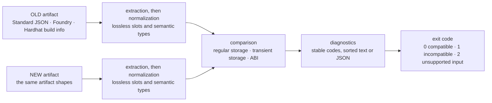
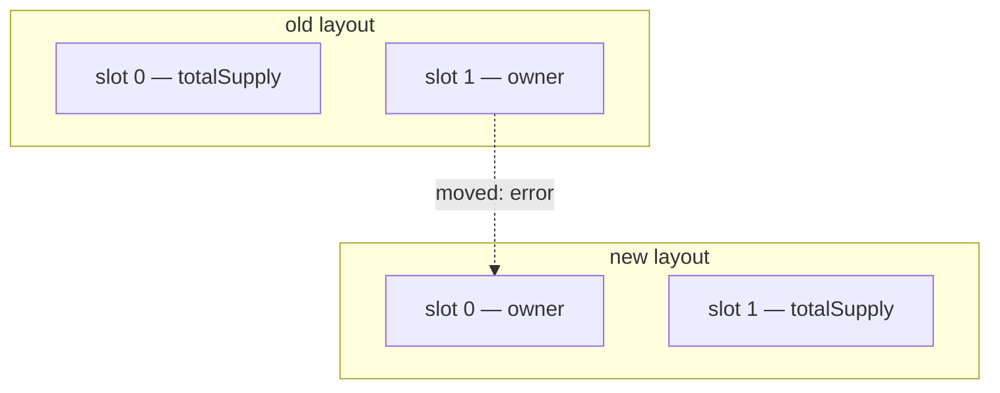

**English** | [简体中文](README.md)

# MoonUpgradeGuard

MoonUpgradeGuard is a MoonBit-native compatibility checker for upgrades of
EVM smart contracts. It compares Solidity compiler artifacts from two contract
versions and reports storage-layout and ABI changes that may make a proxy
upgrade unsafe.

It runs fully offline, never compiles Solidity source, and never touches a
chain, a wallet, or a key. Its inputs are existing compiler artifacts, and its
output is deterministic text or JSON with CI-friendly exit codes.

The core library, the storage and ABI comparison engines, and a native CLI are
implemented and covered by tests. See [Limitations](#limitations) for what is
deliberately not covered yet, and the [roadmap](ROADMAP.md) for what is planned
next.

## How it works



Nothing in that pipeline needs the network, the Solidity source, or a chain: the
artifacts are the only input. The comparison core takes plain values, which is why
the same code is usable as a library without the CLI.

## Requirements

- The [MoonBit](https://www.moonbitlang.com/) toolchain, including the native
  backend that the CLI is built with.
- Python 3 for `scripts/e2e.sh`, which uses it only to validate JSON output.

The analysis itself makes no network calls. A cold module cache is populated
from the MoonBit registry before the first build, as with any MoonBit project.

## Build and test

```bash
moon check --deny-warn
moon test --deny-warn
moon build --target native
```

The native executable is written to

```text
_build/native/debug/build/cmd/moonupgradeguard/moonupgradeguard.exe
```

and to the matching `_build/native/release/...` path for `moon build --target
native --release`. Run it directly, or through `moon run cmd/moonupgradeguard
--` while working in the repository.

`./scripts/e2e.sh` builds the executable and runs every pair in `fixtures/`
through it as a real process, checking exit codes, expected diagnostic codes,
JSON validity, and that repeated runs produce identical bytes.
The test suite also checks invariants over generated layouts: comparing a
layout with itself never blocks, appending a variable never blocks, and the
order of the entries inside an artifact does not change what is reported.

## CLI

```bash
moonupgradeguard check OLD NEW [--format text|json] [--contract NAME|SOURCE:NAME]
moonupgradeguard storage OLD NEW [--format text|json] [--contract NAME|SOURCE:NAME]
moonupgradeguard abi OLD NEW [--format text|json] [--contract NAME|SOURCE:NAME]
```

`--contract` selects a contract from an artifact that holds several, by name or
as `source:contract`; options may appear in any order. The
`fixtures/contract-selector` pair shows both forms, and shows that the selector
decides the verdict.

`check` always compares storage and also compares ABI when both artifacts carry
one. If exactly one artifact has an ABI, it reports invalid input instead of
silently skipping that comparison. `storage` accepts standalone layouts, while
`abi` requires an ABI on both sides.

Exit code `0` means no blocking incompatibility was found, `1` means the
comparison found an incompatible change, and `2` means the command or input was
invalid. A successful report is a preflight result, not proof that an upgrade
is safe in every respect.

Diagnostics are sorted, so the same input always produces the same bytes. In
`--format json` the report is an array of findings on stdout, each with a
stable `code`, a `severity`, a `location`, a `message`, and the compared
`oldValue`/`newValue` where they apply.

With `--format json`, stdout is a JSON array on every exit code, including `2`:
a failure that never reached the analysis reports itself as a finding with a
`cli.*` code, so a JSON reader never has to parse prose. Locations are relative
to the value the reporting layer analysed — extraction reports paths inside the
artifact, the storage engine reports paths inside `storageLayout`, and the CLI
reports the file path when it cannot read one.

## Inputs

Extraction recognizes the artifact shapes that the compilers actually write:

- a raw `storageLayout` object, as printed by `forge inspect` or written by
  layout tooling;
- a flat artifact with `storageLayout` at the top level, as Foundry writes;
- solc Standard JSON output, `contracts.<source>.<contract>`;
- a build info document, `output.contracts.<source>.<contract>`, as Hardhat
  writes.

Layouts produced by solc 0.5 through 0.8 are covered: the 0.5-era `constant`
and `payable` ABI fields are ignored, while an ABI from before `stateMutability`
existed is refused, because `constant` cannot distinguish `pure` from `view`.

Wrappers that can hold several contracts, such as Standard JSON output and build
info, need a selector: `--contract NAME` or `--contract SOURCE:NAME` on the
command line, or `select` in the library API, which takes the same two forms.
Without it, or when the selector matches nothing, extraction reports a
diagnostic instead of guessing.

Two facts are worth knowing when choosing an input:

- A Hardhat per-contract artifact does not embed a storage layout, and
  Hardhat's default compiler settings do not request one. Extract from a build
  info file compiled with `storageLayout` in `outputSelection`, or from a
  standalone layout file.
- Transient storage layouts are compared when the artifact carries one: Foundry
  writes it, and a compiler run needs `transientStorageLayout` in
  `outputSelection`. An artifact that reports none is read as having no
  transient variables, so comparing it against one that does reports a
  removal.

## Reproducible walkthrough

A fresh clone, one compatible check, one incompatible check, one machine-readable
report, and finally a single command that repeats every check. Nothing here needs
the network apart from the first build, which populates the module cache from the
MoonBit registry. The output and exit codes below are the ones the binary prints:
CI runs this section line by line.

```bash
git clone https://github.com/snorfyang/moon-upgrade-guard.git
cd moon-upgrade-guard
moon build --target native
```

**1. Appending only: compatible.** `fixtures/compatible/` is the same contract
recompiled, so only compiler-generated ids and the order of the type table differ.
`fixtures/append/` adds a variable, a function, and an event at the end, so it
prints informational findings.

```console
$ moon run cmd/moonupgradeguard -- check fixtures/compatible/old.json fixtures/compatible/new.json
$ echo $?
0
```

```console
$ moon run cmd/moonupgradeguard -- check fixtures/append/old.json fixtures/append/new.json
info[abi.event.added] abi.events: event "Paused(address)" was added to the new ABI (new: Paused(address))
info[abi.function.added] abi.functions: function "pause()" was added to the new ABI (new: pause())
info[storage.entry.added] contracts/Token.sol:Token storage[2]: variable "paused" was added at slot 2, offset 0 (new: paused)
$ echo $?
0
```

**2. Moving existing variables: incompatible.** `fixtures/storage-moved/` swaps the
slots of `totalSupply` and `owner`. Not a byte is lost, but every byte now means
something else, so the exit code is `1`.

```console
$ moon run cmd/moonupgradeguard -- check fixtures/storage-moved/old.json fixtures/storage-moved/new.json
error[storage.entry.slot.changed] contracts/Token.sol:Token storage[0]: variable "totalSupply" moved from slot 0 to slot 1 (old: 0, new: 1)
error[storage.entry.slot.changed] contracts/Token.sol:Token storage[1]: variable "owner" moved from slot 1 to slot 0 (old: 1, new: 0)
$ echo $?
1
```

**3. Machine-readable output.** With `--format json`, stdout is a JSON array on
every exit code, including `2`.

```console
$ moon run cmd/moonupgradeguard -- check fixtures/abi-function-removed/old.json fixtures/abi-function-removed/new.json --format json
[
  {
    "code": "abi.function.removed",
    "severity": "error",
    "location": {"path": "abi.functions"},
    "message": "function \"transfer(address,uint256)\" is missing from the new ABI",
    "oldValue": "transfer(address,uint256)"
  }
]
$ echo $?
1
```

**4. Everything at once.**

```bash
./scripts/e2e.sh
```

It runs every pair in `fixtures/` through the binary as a real process and checks
exit codes, expected diagnostic codes, JSON validity, and that repeated runs
produce identical bytes, printing `e2e: N checks passed` at the end.

Exit codes: `0` compatible, `1` a blocking incompatibility, `2` input that could
not be analysed, where the report still explains why. The severity and meaning of
every code is in the [diagnostics reference](docs/diagnostics.en.md).

## Use in CI

Exit codes are the contract, so a check can gate a deployment pipeline
directly:

```yaml
- name: upgrade compatibility
  run: |
    moon build --target native
    _build/native/debug/build/cmd/moonupgradeguard/moonupgradeguard.exe \
      check build/old.json build/new.json --format json
```

A step that exits `1` fails the job, which is the intended behavior. Treat
`2` as a separate failure class: it means the tool could not analyze the input,
so a pipeline should fail loudly and fix the artifact rather than retrying.

## Compatibility model

Every finding carries a stable code; the [diagnostics
reference](docs/diagnostics.en.md) lists all of them with their severity and
meaning.

Only `Error` findings block an upgrade. `Warning` findings leave the layout or
interface compatible but need review, and `Info` findings are additive.

Storage findings:

- `Error`: a variable that disappeared, a variable that moved slot or byte
  offset, and a variable whose semantic type changed, including nested struct,
  array, and mapping changes.
- `Warning`: a variable renamed at the same position with the same type. The
  bytes stay where they were, so the layout is still compatible, but the new
  name may carry a new meaning.
- `Info`: a variable that appears only in the new layout, so appending is
  compatible, and a storage gap that was resized in place.

A swap shows why a move is an error even though no byte is lost:



Regular and transient storage follow the same rules. A transient finding names
`transientStorage[...]` rather than `storage[...]`, so a report tells the two
address spaces apart.

Storage gaps use the `__gap` fixed-size array convention: the bytes a gap
covers are unused, so a later version may spend them on new variables, or
replace the gap wholesale, as long as whatever takes its place ends at the byte
the gap ended at. That is what keeps everything declared after the gap in place.
The name alone never skips a comparison: the type has to be a fixed-size array
(a dynamic array's slot holds its length, not reserved bytes), the element type
has to stay the same, and a gap whose end moved is reported as a move.

The rename policy, and the one place where this tool differs from OpenZeppelin
Upgrades Core by default, is recorded with the rest of the differential results
in [`docs/oz-differential.en.md`](docs/oz-differential.en.md).

ABI findings:

- `Error`: a signature that disappeared from functions, events, or custom
  errors; a changed output list, because callers decode return data
  positionally; a changed indexed layout or anonymity on an event; a
  selector or topic that now belongs to a different signature; and a
  `fallback`/`receive` handler replaced by a named function of the same
  signature (or the reverse), because the two are reached differently: one
  answers otherwise-unmatched calldata and the other is selector-dispatched.
- `Warning`: a changed state mutability, because the selector and calldata are
  unchanged while the call's contract changed.
- `Info`: a new function, event, or error.

## Limitations

- ERC-7201 namespaced storage is not analysed, and an artifact that mentions it
  is refused with an error rather than reported compatible. A namespace is
  reached through a slot that its own annotation derives, so the compiler's
  `storageLayout` — which lists state variables — does not contain its members,
  and checking them would need the abstract syntax tree plus a recompilation
  that this tool deliberately does not perform. Extracting a layout on its own
  leaves no trace of a namespace at all, so pass a full artifact.
- Constructors are not compared: their inputs affect deployment, not the
  interface an existing proxy exposes.
- When both artifacts are invalid, their findings share one sorted list and a
  location does not say which artifact it came from. Compare the artifacts one
  at a time to see which is at fault; tagging every finding with its source
  would change the diagnostic contract, so it is left to a deliberate change.
- ABI compatibility here is caller compatibility. It is not Solidity source
  compatibility, and it says nothing about whether the new code behaves the
  same way.
- A passing report is a preflight check, not an audit.

## Non-goals

- Compiling Solidity source code.
- Deploying or upgrading contracts.
- Managing wallets, private keys, or RPC endpoints.
- Replacing professional smart-contract audits.
- Proving business-logic equivalence between contract versions.

## License

Apache License 2.0. The specifications behind the rules, the dependency
licences, and the provenance of every fixture are recorded in
[references and licensing](docs/references.en.md).
