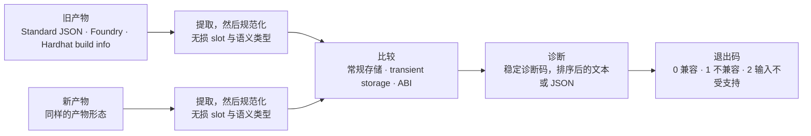
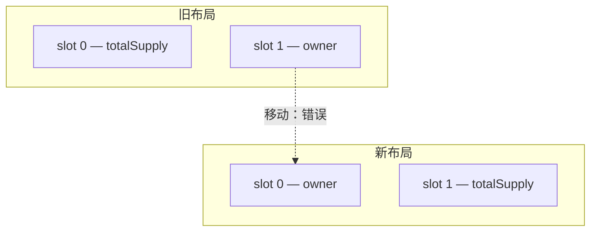

[English](README.en.md) | **简体中文**

[在线文档](https://snorfyang.github.io/moon-upgrade-guard/)

# MoonUpgradeGuard

[](https://github.com/snorfyang/moon-upgrade-guard/actions/workflows/ci.yml)
[](https://github.com/snorfyang/moon-upgrade-guard/actions/workflows/release.yml)
[](https://github.com/snorfyang/moon-upgrade-guard/releases/latest)
[](LICENSE)

MoonUpgradeGuard 是一个用 MoonBit 编写的 EVM 智能合约升级兼容性检查器。
它比较两个合约版本的 Solidity 编译产物，报告可能让代理（proxy）升级变得不安全的存储布局（storage layout）与 ABI 变更。

它完全离线运行，不编译 Solidity 源码，也不接触链、钱包或私钥。输入是已有的编译产物，输出是确定性的文本或 JSON，并带有对 CI 友好的退出码。

核心库、存储与 ABI 比较引擎以及 native 命令行均已实现并有测试覆盖。哪些内容是有意暂不支持的，见[已知限制](#已知限制)；后续计划见[路线图](ROADMAP.md)。

## 工作原理



这条流水线不需要网络、不需要 Solidity 源码，也不需要链：产物是唯一的输入。比较核心接收的是普通的值，因此同一份代码不通过命令行也可以直接作为库使用。

## 仓库结构

- `src/`：MoonBit 核心库及其测试；`src/cmd/moonupgradeguard/` 是原生命令行。
- `fixtures/`：兼容性样例、真实编译产物及其来源说明。
- `scripts/`：端到端、文档和发布包检查。
- `docs/`：诊断码、参考资料和差分对比记录。

## 环境要求

- [MoonBit](https://www.moonbitlang.com/) 工具链，包含构建命令行所需的
  native 后端。
- Python 3，仅用于 `scripts/e2e.sh` 校验 JSON 输出。

分析本身不发起任何网络请求。与任何 MoonBit 项目一样，首次构建前需要从 MoonBit
注册表填充模块缓存。

## 构建与测试

```bash
moon check --deny-warn
moon test --deny-warn
moon build --target native
```

native 可执行文件输出到：

```text
_build/native/debug/build/cmd/moonupgradeguard/moonupgradeguard.exe
```

使用 `moon build --target native --release` 时输出到对应的
`_build/native/release/...` 路径。可以直接运行该文件，也可以在仓库内通过
`moon run src/cmd/moonupgradeguard --` 运行。

[GitHub Releases](https://github.com/snorfyang/moon-upgrade-guard/releases)
提供经过端到端检查的 Linux x86_64 与 macOS arm64 原生可执行文件。

`./scripts/e2e.sh` 会构建可执行文件，并把 `fixtures/` 中的每一对样例当作真实进程跑一遍，校验退出码、应出现的诊断码、JSON 合法性，以及重复运行是否产生完全一致的字节。
`python3 scripts/check_package.py` 会构建发布包，并核对包内文件清单。

测试还会针对生成的布局检查若干不变量：同一布局与自身比较不会阻断，追加变量不会阻断，产物内部条目的顺序也不会改变报告内容。

## 命令行

```bash
moonupgradeguard check OLD NEW [--format text|json] [--contract NAME|SOURCE:NAME]
moonupgradeguard storage OLD NEW [--format text|json] [--contract NAME|SOURCE:NAME]
moonupgradeguard abi OLD NEW [--format text|json] [--contract NAME|SOURCE:NAME]
moonupgradeguard --version
```

`--version` 输出 `moonupgradeguard 0.1.0`；端到端测试会核对它与 `moon.mod` 一致。

`--contract` 用于从包含多个合约的产物中选择一个，可以写合约名，也可以写
`source:contract`；选项可以按任意顺序出现。`fixtures/contract-selector` 这一对样例展示了两种写法，也展示了选择哪个合约会直接决定结论。

`check` 始终比较存储；当两边产物都带有 ABI 时也一并比较 ABI。如果只有一边带有
ABI，它会报告输入无效，而不是静默跳过该比较。`storage` 接受独立的
`storageLayout`，`abi` 则要求两边都带 ABI。

产物中的数字必须是整数字面量。支持的所有产出工具（solc Standard JSON、Foundry、
Hardhat）只写整数；带小数点或指数的数字会被当作不可用的 schema 数据拒绝，而不是四舍五入后当作整数使用。

退出码 `0` 表示未发现阻断性不兼容，`1` 表示比较发现不兼容变更，`2` 表示命令或输入无效。通过的检查结果是升级前的预检结论，并不证明升级在所有方面都安全。

诊断经过排序，因此相同输入总是产生完全相同的字节。使用 `--format json` 时，
stdout 上是诊断项组成的 JSON 数组，每一项带有稳定的 `code`、`severity`、
`location`、`message`，以及在适用时给出被比较的 `oldValue`/`newValue`。
由单侧输入产生的错误还带有 `input: "old"` 或 `input: "new"`；比较诊断没有该字段。

使用 `--format json` 时，任何退出码下 stdout 都是 JSON 数组，包括 `2`：尚未进入分析阶段的失败会以带有 `cli.*` 诊断码的诊断项形式报告自身，因此 JSON 读取方永远不必解析普通文本。位置（location）相对于产生它的层所分析的值——提取层报告产物内部的路径，存储引擎报告 `storageLayout` 内部的路径，命令行则在无法读取文件时报告该文件路径。

## 输入

提取层识别编译器实际写出的产物形态：

- 原始的 `storageLayout` 对象，例如 `forge inspect` 打印或布局工具写出的形式；
- 顶层带 `storageLayout` 的扁平产物，即 Foundry 写出的形式；
- solc Standard JSON 输出，`contracts.<source>.<contract>`；
- build info 文档，`output.contracts.<source>.<contract>`，即 Hardhat 写出的形式。

已覆盖 solc 0.5 至 0.8 产出的布局：0.5 时代的 `constant`、`payable` 等 ABI
字段会被忽略，而在 `stateMutability` 出现之前的 ABI 会被拒绝，因为 `constant`
无法区分 `pure` 与 `view`。

可能包含多个合约的外层结构（例如 Standard JSON 输出和 build info）需要指定选择器：命令行上的 `--contract NAME` 或 `--contract SOURCE:NAME`，或库 API 中的
`select`（两者形式相同）。未提供或选择器匹配不到任何合约时，提取层会给出诊断而不是猜测。

选择输入时有两件事值得注意：

- Hardhat 的单合约产物不内嵌存储布局，Hardhat 的默认编译设置也不会请求它。请使用在 `outputSelection` 中请求了 `storageLayout` 的 build info 文件，或使用独立的布局文件。
- 当产物带有 transient storage 布局时，它会被比较：Foundry 会写出该布局，用
  solc 时需要在 `outputSelection` 中包含 `transientStorageLayout`。没有报告该布局的产物会被视为没有 transient storage 变量，因此与带有该布局的产物比较时会报告为删除。

## 复现走查

下面从零走一遍：一次兼容检查、一次不兼容检查、一次机器可读输出，最后用一条命令跑完整验证。命令不需要网络（首次构建会从 MoonBit 注册表填充模块缓存），本节中的输出与退出码与真实运行逐字一致——CI 会逐条核对。

```bash
git clone https://github.com/snorfyang/moon-upgrade-guard.git
cd moon-upgrade-guard
moon build --target native
```

**1. 只追加内容：兼容。** `fixtures/compatible/` 是同一个合约重新编译的结果，只有编译器生成的 id 与类型表顺序不同；`fixtures/append/` 在末尾追加了一个变量、一个函数和一个事件，因此只输出信息级诊断。

```console
$ moon run src/cmd/moonupgradeguard -- check fixtures/compatible/old.json fixtures/compatible/new.json
$ echo $?
0
```

```console
$ moon run src/cmd/moonupgradeguard -- check fixtures/append/old.json fixtures/append/new.json
info[abi.event.added] abi.events: event "Paused(address)" was added to the new ABI (new: Paused(address))
info[abi.function.added] abi.functions: function "pause()" was added to the new ABI (new: pause())
info[storage.entry.added] contracts/Token.sol:Token storage[2]: variable "paused" was added at slot 2, offset 0 (new: paused)
$ echo $?
0
```

**2. 移动已有变量：不兼容。** `fixtures/storage-moved/` 把 `totalSupply` 与 `owner` 交换了
slot：一个字节都没有丢，但每个字节的含义都变了，所以退出码是 `1`。

```console
$ moon run src/cmd/moonupgradeguard -- check fixtures/storage-moved/old.json fixtures/storage-moved/new.json
error[storage.entry.slot.changed] contracts/Token.sol:Token storage[0]: variable "totalSupply" moved from slot 0 to slot 1 (old: 0, new: 1)
error[storage.entry.slot.changed] contracts/Token.sol:Token storage[1]: variable "owner" moved from slot 1 to slot 0 (old: 1, new: 0)
$ echo $?
1
```

**3. 机器可读输出。** `--format json` 下 stdout 始终是一个 JSON 数组，即使在退出码 `2` 时也是如此。

```console
$ moon run src/cmd/moonupgradeguard -- check fixtures/abi-function-removed/old.json fixtures/abi-function-removed/new.json --format json
[
  {
    "code": "abi.function.removed",
    "severity": "error",
    "location": {"path": "abi.functions"},
    "message": "function \"transfer(address,uint256)\" is missing from the new ABI",
    "oldValue": "transfer(address,uint256)"
  }
]
$ echo $?
1
```

**4. 一条命令跑完全部检查。**

```bash
./scripts/e2e.sh
```

它以真实进程运行 `fixtures/` 中的每一对样例，核对退出码、应出现的诊断码、JSON 合法性，
以及重复运行是否产生完全一致的字节，最后打印 `e2e: N checks passed`。

退出码含义：`0` 兼容，`1` 发现阻断性不兼容，`2` 输入无法分析（此时报告仍然输出，并说明原因）。每个诊断码的严重度与含义见[诊断码手册](docs/diagnostics.md)。

## 在 CI 中使用

退出码就是契约，因此可以直接用它来卡住部署流水线：

```yaml
- name: upgrade compatibility
  run: |
    moon build --target native
    _build/native/debug/build/cmd/moonupgradeguard/moonupgradeguard.exe \
      check build/old.json build/new.json --format json
```

以 `1` 退出的步骤会让任务失败，这正是预期行为。请把 `2` 当作另一类失败：它表示工具无法分析该输入，流水线应当明确失败并修复产物，而不是重试。

## 兼容性模型

只有 `Error` 级诊断会阻断升级。完整的诊断码清单、每个码的严重度与含义，见
[诊断码手册](docs/diagnostics.md)。`Warning` 级表示布局或接口仍兼容但需要人工确认，
`Info` 级表示新增。

存储相关诊断：

- `Error`：变量消失；变量移动了 slot 或字节 offset；变量的语义类型发生变化，
  包括嵌套的 struct、数组和 mapping 变化。
- `Warning`：变量在同一位置、类型不变的情况下被重命名。字节仍在原处，因此布局依然兼容，但新名字可能承载了新的含义。
- `Info`：只出现在新布局中的变量（因此追加是兼容的），以及在原位调整大小的存储
  gap。

下面这个互换的例子说明，为什么一个字节都没丢的“移动”仍然是错误：



常规存储与 transient storage 遵循同一套规则。transient storage 的诊断项使用
`transientStorage[...]` 而非 `storage[...]` 作为位置，因此报告能区分这两个地址空间。

存储 gap 使用 `__gap` 定长数组约定：gap 覆盖的字节是未使用的，因此后续版本可以把它们用于新变量，也可以整体替换该 gap，前提是取代它的内容结束在 gap 原先结束的那个字节——这正是让声明在它之后的变量保持在原位的原因。仅凭名字永远不会跳过比较：类型必须是定长数组（动态数组的 slot 存放长度而非保留字节），元素类型必须保持不变，而结束位置发生变化的 gap 仍会被报告为移动。

重命名策略是本工具与 OpenZeppelin Upgrades Core 默认行为唯一不同之处，相关差分结果记录在 [`docs/oz-differential.md`](docs/oz-differential.md)。

ABI 相关诊断：

- `Error`：function、event 或自定义错误的签名消失；返回类型列表发生变化，因为调用方按位置解码返回数据；event 的 indexed 布局或匿名性发生变化；某个 selector
  或 topic 现在属于另一个签名；`fallback`/`receive` 处理器被同签名的具名函数取代
  （或反之），因为两者到达方式不同：一个应答未被匹配的 calldata，另一个按 selector 分发。
- `Warning`：状态可变性（state mutability）变化，因为 selector 与 calldata 未变，而调用契约变了。
- `Info`：新增 function、event 或自定义错误。

## 已知限制

- ERC-7201 命名空间存储（namespaced storage）不参与分析，提到它的产物会被报错拒绝，而不是报告为兼容。命名空间通过其注释自行推导出的 slot 访问，而编译器
  `storageLayout` 只列出状态变量，因此其中不包含命名空间成员；要检查这些成员，
  需要抽象语法树，外加一次本工具有意不执行的重新编译。单独提取布局文件也不会留下任何命名空间的痕迹，因此请传入完整产物。
- constructor 不参与比较：它的入参影响部署，而不是已部署代理对外暴露的接口。
- 这里的 ABI 兼容性指的是调用方兼容性，既不等同于 Solidity 源码兼容性，也不说明新代码的行为是否一致。
- 通过的检查结果是升级前预检，而不是审计。

## 非目标

- 编译 Solidity 源码。
- 部署或升级合约。
- 管理钱包、私钥或 RPC 端点。
- 替代专业智能合约审计。
- 证明合约版本之间的业务逻辑等价。

## 许可证

Apache License 2.0。规则依据的规范、依赖许可证与 fixture 来源见[参考与许可](docs/references.md)。
